# Діаграми — Урок 28: Теорія Графів та Neo4j

---

## 1. Що таке граф? Основна анатомія

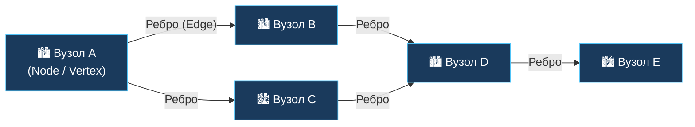

**Граф G = (V, E)**, де:
- **V** — множина вузлів (vertices): `{A, B, C, D, E}`
- **E** — множина ребер (edges): `{(A,B), (A,C), (B,D), (C,D), (D,E)}`

> **Ключова ідея:** вузол — це сутність, ребро — це зв'язок.
> Граф зберігає реальність такою, якою вона є, не спотворюючи її у таблиці.

---

## 2. Спрямований vs. Неспрямований граф

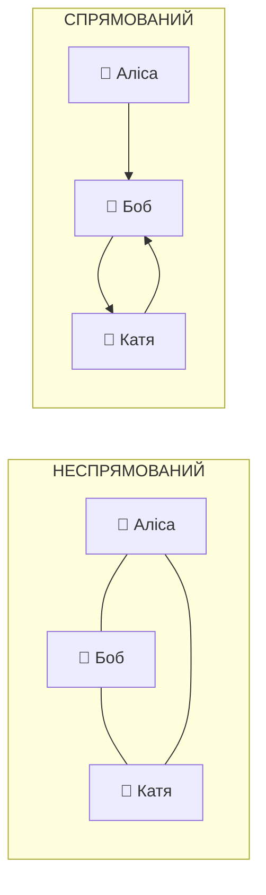

| Властивість | Неспрямований | Спрямований |
|-------------|---------------|-------------|
| Ребро | `{u, v}` — симетричне | `(u, v)` — від u до v |
| Приклад | Facebook-дружба, дорога (2-смугова) | Twitter-підписка, одностороння вулиця |
| In/Out degree | Немає різниці | `in-degree` ≠ `out-degree` |
| Алгоритми | BFS, DFS без перевірки напрямку | Топологічне сортування, Dijkstra |

---

## 3. Зважений граф — реальні «витрати» на ребрах

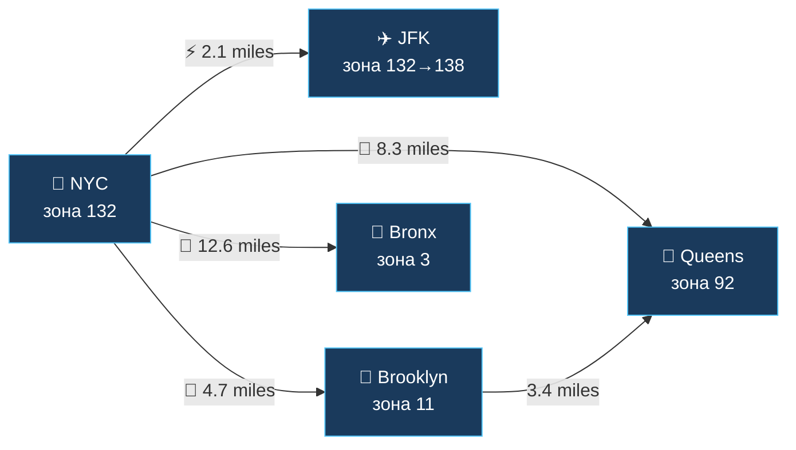

**Навіщо потрібні ваги:**
- Без ваги: BFS знаходить шлях з мінімальною кількістю переходів (хопів)
- З вагою: Dijkstra / A\* знаходить шлях з **мінімальною вартістю** (дистанція, час, $)
- Для пріоритетної черги вагового пошуку: складність `O((V + E) log V)`

---

## 4. Дерево vs. Граф — ієрархія проти мережі

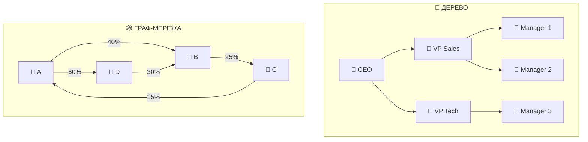

> **Корпоративна власність утворює цикли** — класичне дерево не може це представити.
> Граф — може. Саме тому Neo4j застосовується для Anti-Money Laundering (AML) аналізу.

---

## 5. BFS — обхід у ширину (хвиля)

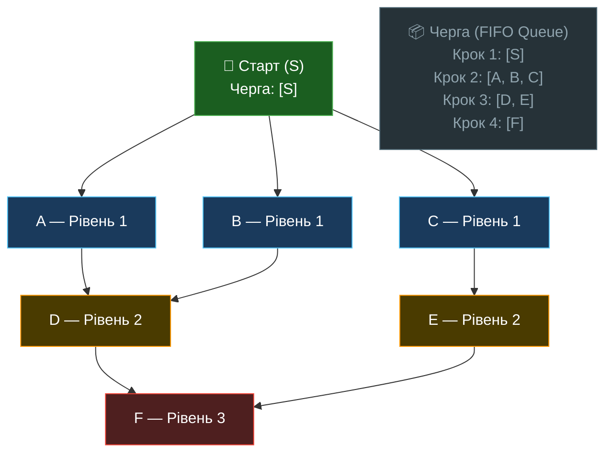

**BFS Гарантія:** перший раз коли алгоритм знаходить цільовий вузол — це **найкоротший шлях** (мінімум хопів).

**Складність:**
- Час: `O(V + E)`
- Пам'ять: `O(V)` — у найгіршому випадку черга містить усі вузли одного рівня

---

## 6. DFS — обхід у глибину (занурення)

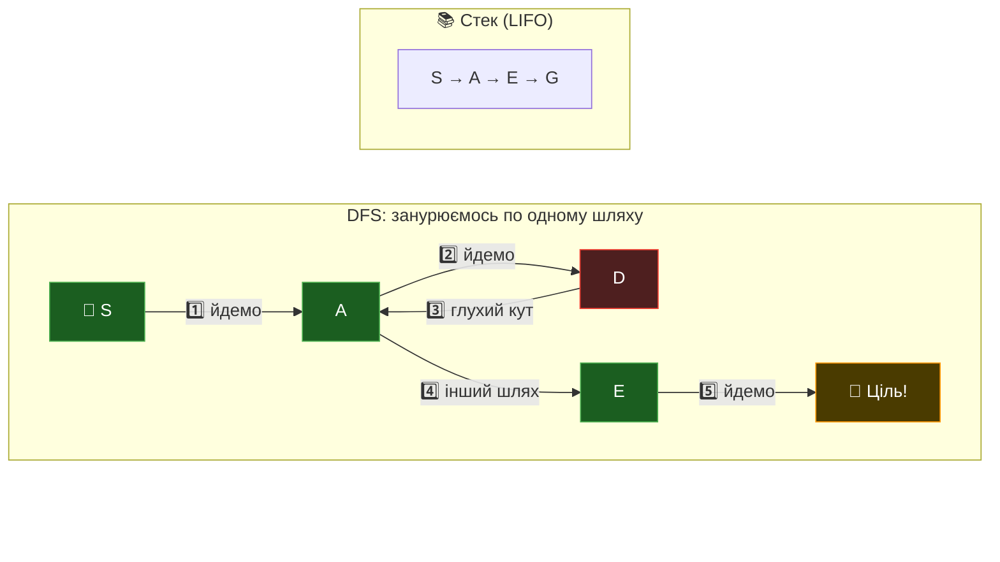

**DFS застосування:**
- Пошук зв'язних компонент (окремих острівців у мережі)
- Топологічне сортування (порядок компіляції файлів)
- Пошук циклів у графі (виявлення fraud rings)
- Розв'язання лабіринтів

---

## 7. Алгоритм Дейкстри — найдешевший маршрут

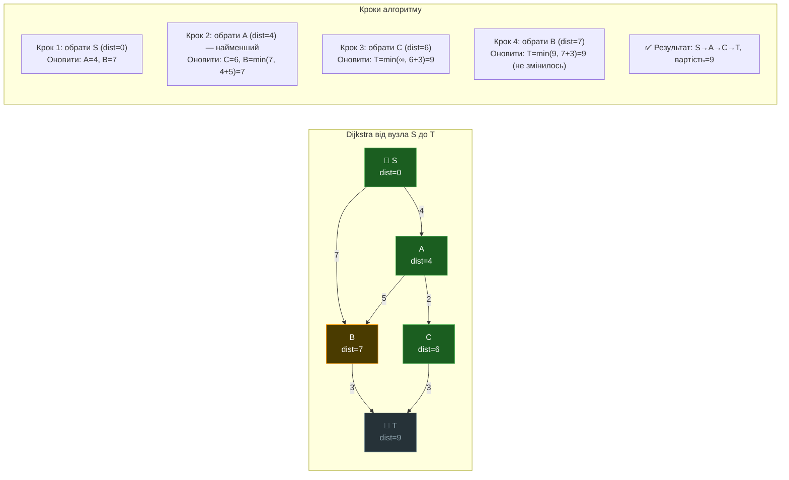

**Dijkstra vs BFS:**
| | BFS | Dijkstra |
|--|-----|---------|
| Граф | Незважений | Зважений |
| Структура | FIFO черга | Пріоритетна черга (min-heap) |
| Складність | `O(V + E)` | `O((V + E) log V)` |
| Гарантія | Мін. кількість хопів | Мін. вартість шляху |

---

## 8. SQL JOIN vs. Graph Traversal — проблема глибини

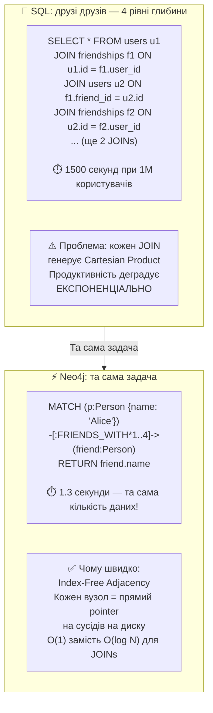

---

## 9. Neo4j Index-Free Adjacency — архітектура зберігання

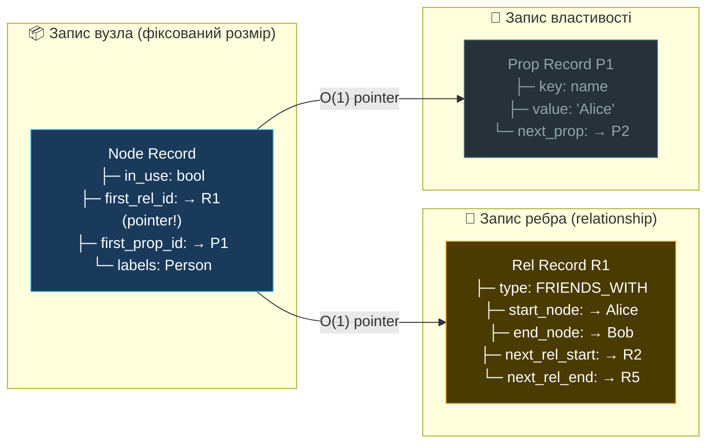

> **Секрет Neo4j:** обхід ребра — це просто **chase pointer** (слідувати по вказівнику).
> Не потрібно сканувати жодний глобальний індекс. Час: **O(1)**, незалежно від розміру БД.

---

## 10. NYC Taxi Zone Graph — наш сценарій

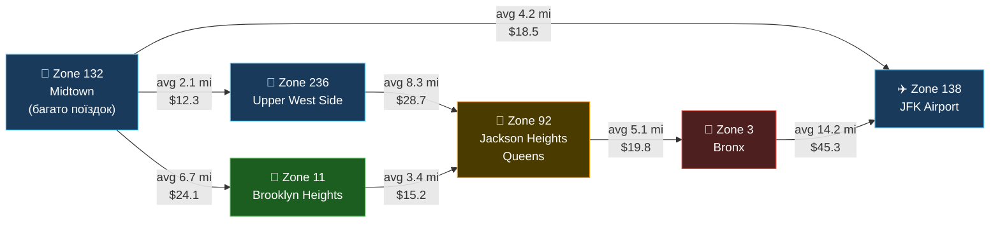

**Задача лабораторії:**
1. Завантажити NYC Taxi дані через DuckDB (3M+ рядків)
2. Побудувати граф зон (adjacency list) з реальних поїздок
3. BFS: знайти найближчу зону за мін. кількістю переходів
4. Dijkstra: знайти найдешевший маршрут між зонами (за середньою вартістю)
5. Dispatch Optimizer: отримати запит — повернути ранжований список доступних таксі

---

## 11. Recommendation Engine — граф рекомендацій

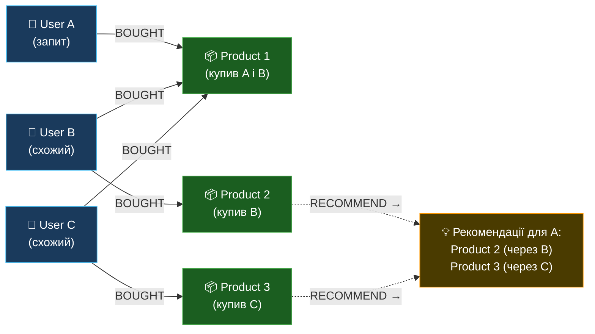

**Cypher запит (Neo4j):**
```cypher
MATCH (me:User {id: "A"})-[:BOUGHT]->(p:Product)<-[:BOUGHT]-(similar:User)
MATCH (similar)-[:BOUGHT]->(rec:Product)
WHERE NOT (me)-[:BOUGHT]->(rec)
RETURN rec.name, count(similar) AS score
ORDER BY score DESC
LIMIT 10
```

---

## 12. Fraud Detection — виявлення шахрайських кілець

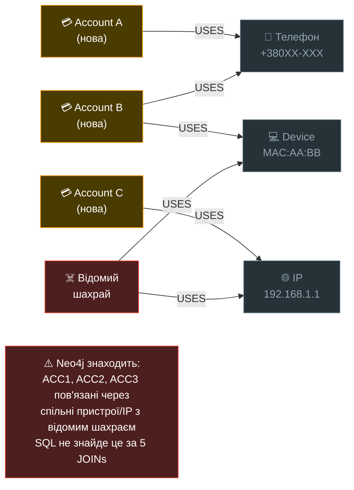
